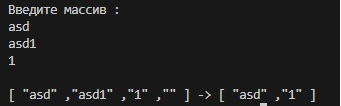
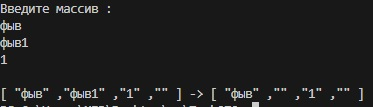

# Программа, которая из имеющегося массива строк формирует новый массив из строк, длина которых меньше, либо равна 3 символам.

## Первоначальный массив можно ввести с клавиатуры, либо задать на старте выполнения алгоритма. При решении *`не рекомендуется`* пользоваться *`коллекциями`*, лучше обойтись исключительно массивами.

* ### Вводим массив с помощью клавиатуры
* ### CreaterArray
**Создаёт массив заполненный с клавиатуры**
* ### FiltredArray 
**Сортирует массив по условию задачи и записывает данные в новый массив**
* ### PrintArray 
**Выводит массив в терминале**
* ### Цикл foreach
**Убирает пустые индексы**
### Пример вывода с циклом и без него 
* #### С циклом foreach

* #### Без цикла

#### `Без цикла forreach остаются не нужные пустые индексы, которые ненужны при выводе. Это единственный рабочий способ, который мне удалось найти`